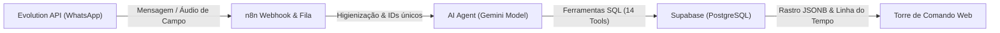

# Anotado — Torre de Comando & Mitigação de Riscos 🚀
### AM Consultorias — Projeto Acadêmico-Comercial (PjBL)
*Cadeira de Banco de Dados — Centro Universitário Dom Bosco (UNDB)*

---

## 📌 Visão Geral do Projeto

O **Anotado** é uma plataforma SaaS de inteligência operacional e mitigação de riscos desenvolvida sob demanda para a **AM Consultorias** (representada pelo parceiro de negócio Adriano). O sistema atende a **Economia do Cuidado** — um setor que engloba asilos (ILPIs), clínicas, CAPS e creches. 

Nesse segmento, a desorganização de dados não representa apenas prejuízo financeiro: a perda de um controle de medicação de idosos ou o atraso na entrega de um laudo de conformidade técnica da ANVISA coloca **vidas vulneráveis em risco físico direto**, além de gerar **pesados passivos sanitários e trabalhistas**.

O **Anotado** resolve esse gargalo ao integrar um banco de dados relacional rígido e robusto no **Supabase (PostgreSQL)** a um pipeline de automação inteligente baseado em **IA (Gemini)** e **n8n**, apelidado carinhosamente de **"Estagiário de Bolso"**. O consultor de campo Adriano envia um áudio no WhatsApp ao sair de uma visita; o sistema compreende o conteúdo, transcreve os laudos técnicos, agenda prazos regulatórios de forma autônoma e atualiza uma elegante **Torre de Comando Web** em tempo real.

---

## 🎨 Design System Premium (Light Mode)

A aplicação foi integralmente desenvolvida sob um **Light Mode Ultra-Premium**, abandonando as cores padrão do navegador em prol de um design clean, científico, moderno e translúcido:
*   **Contraste & Elegibilidade:** Harmonização de tons de ardósia (*Slate*), esmeralda (*Emerald*), índigo (*Indigo*), azul do céu (*Sky*) e fuchsia (*Fuchsia*) para categorização de riscos e sentimentos.
*   **Responsividade Nativa Completa:** Telas administrativas de clientes, operações de campo e linha do tempo de logs adaptadas com perfeição para smartphones, tablets e desktops de qualquer proporção.
*   **Menu Drawer Mobile:** Componente responsivo premium com menu hambúrguer flutuante, transição suave de drawer lateral e efeito de vidro fosco (`backdrop-blur-sm bg-slate-900/60`).

---

## ⚙️ Arquitetura de Engenharia (O "Estagiário de Bolso")

A automação opera através de um pipeline moderno em 4 etapas:



1.  **Entrada (Evolution API):** Captura mensagens de áudio ou texto enviadas pelo Adriano enquanto ele está em trânsito.
2.  **Triagem e Fila (n8n Webhook):** O n8n recebe as requisições, faz a higienização de números telefônicos via Expressões Regulares (Regex) e valida a unicidade da interação para blindar o banco de dados contra duplicidades.
3.  **Processador Cognitivo (AI Agent & Gemini):** O agente de inteligência artificial consome o modelo Gemini. Ele transcreve o áudio, infere o sentimento da conversa, extrai tópicos e decide qual das **14 ferramentas SQL integradas** executar autonomamente.
4.  **Persistência (Supabase/PostgreSQL):** As informações extraídas pela IA são mapeadas diretamente nas tabelas relacionais do banco.

---

## 🗄️ Modelagem de Banco de Dados (DER)

O coração do sistema é o banco de dados PostgreSQL composto por **5 tabelas relacionais** estruturadas de forma rígida para garantir integridade referencial máxima.

### Estrutura Física das Tabelas (`db.sql`)

| Tabela | Chaves (Keys) | Propósito | Características Técnicas |
| :--- | :--- | :--- | :--- |
| **`clientes`** | `id` (PK uuid) | Cadastro das instituições de acolhimento (ILPI, CAPS, Creches). | Ponto central de integridade referencial (relacionamentos 1:N). |
| **`contratos`** | `id` (PK uuid)<br>`cliente_id` (FK) | Registro dos planos comerciais e mensalidades ativas. | Garante integridade referencial com `ON DELETE CASCADE / RESTRICT` ligada ao cliente. |
| **`visitas`** | `id` (PK uuid)<br>`cliente_id` (FK) | Cronograma de Visitas Técnicas Presenciais (Atividade Física). | Controla a data de ida a campo e armazena os relatórios técnicos. |
| **`tarefas_entregas`** | `id` (PK uuid)<br>`cliente_id` (FK)<br>`visita_id` (FK) | Controle de prazos, obrigações e laudos regulatórios (Atividade Intelectual). | Vincula o prazo à visita que a originou e alerta atrasos automaticamente. |
| **`log_interacoes`** | `id` (PK uuid)<br>`cliente_id` (FK) | Rastro diário e linha do tempo de mensagens integradas ao WhatsApp. | Contém uma **coluna flexível JSONB (`metadados`)** para logs de sentimento da IA. |

---

## 📽️ Rota Nativa de Slides Interativos (`/slides`)

Para as apresentações na **UNDB**, construímos um **visualizador de slides premium 100% nativo integrado no próprio frontend do projeto** (disponível no menu lateral). 

*   **Design 16:9 Adaptável:** Visualizador inteligente que se projeta em tela cheia (`F11` ou botão dedicado) no desktop em proporção widescreen, e se adapta em celulares com rolagem inteligente (`overflow-y-auto aspect-auto`) para não esmagar o conteúdo.
*   **Slide 3 (DER Interativo):** O apresentador pode passar o mouse ou tocar nos cards das tabelas para destacar dinamicamente suas chaves PK/FK e relacionamentos. O tamanho das tabelas foi refinado no mobile (`text-xs`) garantindo legibilidade perfeita no celular.
*   **Slide 4 (Arquitetura de Abas Dinâmicas):** Navegação entre Diagrama Conceitual em 5 colunas, Print Real do fluxo geral n8n, AI Agent com suas ferramentas e Triagem Webhook de Entrada. Ao clicar nas imagens reais do n8n, elas se expandem em um **Modo Lightbox Cinemático** focado.
*   **Controles de Teclado Nativo:** Teclas de setas (Direita/Esquerda), `Espaço` ou `Enter` passam os slides suavemente. Pressionar `ESC` sai da apresentação e retorna instantaneamente para a Torre de Comando.

---

## 🛠️ Tecnologias Utilizadas

*   **Frontend Core:** Next.js (App Router), React, TypeScript.
*   **Estilização:** TailwindCSS (Design responsivo reativo premium).
*   **Iconografia:** Lucide-React.
*   **Banco de Dados:** Supabase, PostgreSQL.
*   **Orquestração de Automação:** n8n Workflow Automation.
*   **Modelos de Linguagem e IA:** Google Gemini API & AI Agents.
*   **Integração de Mensageria:** Evolution API (WhatsApp).

---

## 🚀 Como Executar o Projeto Localmente

### 1. Pré-requisitos
*   Node.js (versão 18 ou superior)
*   npm, yarn ou pnpm instalado

### 2. Instalação de Dependências
Clone o repositório e execute a instalação na pasta raiz:
```bash
npm install
```

### 3. Configuração de Variáveis de Ambiente
Crie um arquivo `.env` na raiz do projeto com as chaves de conexão do Supabase real (conforme configurado em produção):
```env
NEXT_PUBLIC_SUPABASE_URL=sua_url_do_supabase
NEXT_PUBLIC_SUPABASE_ANON_KEY=sua_chave_anonima
```

### 4. Executando o Servidor de Desenvolvimento
Inicie o servidor localmente:
```bash
npm run dev
```
Abra [http://localhost:3000](http://localhost:3000) no seu navegador para ver o sistema rodando ativamente.

### 5. Verificação de Integridade Estática
Para certificar-se de que não existem erros sintáticos no TypeScript e que o build está 100% íntegro:
```bash
npx tsc --noEmit
```

---

## 👨‍🏫 Equipe de Desenvolvimento
*   **Parceiro de Negócio (Consultoria de Campo):** Adriano (AM Consultorias)
*   **Acadêmicos de Engenharia de Software:** Grupo de Alunos — UNDB
*   **Cadeira Acadêmica:** Banco de Dados (Orientador: Prof. Felipe)

---
*AM Consultorias &copy; 2026. Todos os direitos reservados. Focado na Economia do Cuidado e na Proteção de Vidas Humanas por meio de Dados Estruturados.*
