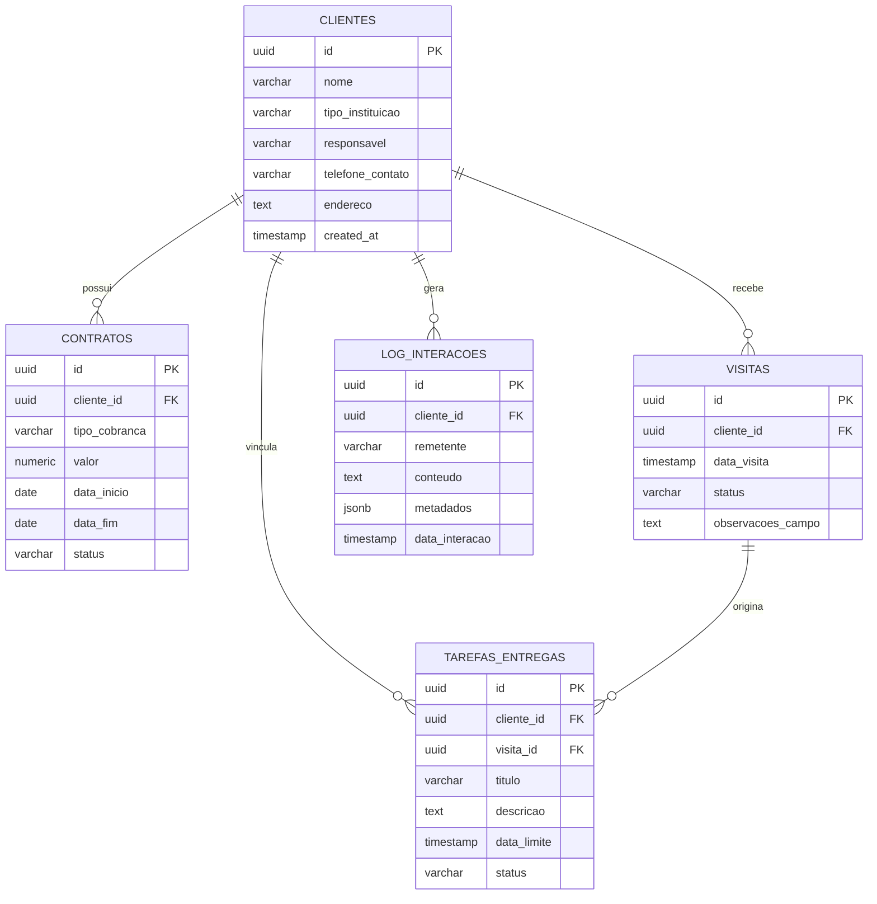
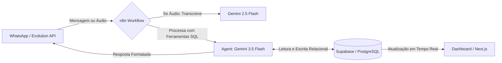

# Pitch Acadêmico & Comercial: AM Consultorias
**Cadeira de Banco de Dados — UNDB (Centro Universitário Dom Bosco)**
*Tempo Estimado de Apresentação: 3 a 5 minutos*

Este documento é a sua estrutura completa de slides e roteiro de apoio para a apresentação em sala de aula. Ele conecta a modelagem relacional de banco de dados diretamente a uma dor de mercado real na **Economia do Cuidado**, demonstrando a arquitetura desenvolvida com **Supabase (PostgreSQL)**, **n8n (IA e Automacão)** e **Next.js**.

---

## 🧭 Visão Geral do Tempo (3 min e 45 seg)

```mermaid
gantt
    title Cronograma do Pitch (Total: 225s)
    dateFormat  X
    axisFormat %s
    section Slides
    1. Capa & Economia do Cuidado (40s) :active, 0, 40
    2. O Dado Social & O Risco (35s) : 40, 75
    3. Modelagem de Dados / DER (45s) : 75, 120
    4. Arquitetura "Estagiário de Bolso" (45s) : 120, 165
    5. Demonstração / Painel Real (40s) : 165, 205
    6. Reflexão Acadêmica & Fechamento (20s) : 205, 225
```



---

## Slide 1: A AM Consultorias e a Economia do Cuidado
### 🕒 Tempo Sugerido: 40 segundos (00:00 - 00:40)

#### 🖥️ Conteúdo Visual do Slide
* **Título Principal:** AM Consultorias: O Desafio da Economia do Cuidado
* **Subtítulo:** Organizando a gestão onde o erro custa vidas.
* **Tópicos:**
  * **O Cliente:** Adriano, fundador da AM Consultorias.
  * **O Segmento:** Gestão operacional para ILPIs (Lares de Idosos), CAPS (Saúde Mental), Creches e Clínicas.
  * **O Problema:** *Paradoxo do Crescimento* — Crescer rápido demais, virando o gargalo operacional.
  * **Método Anterior:** Gestão improvisada em cadernos, planilhas soltas e lembrança mental no WhatsApp.

> [!NOTE]
> **O que é a Economia do Cuidado?** É o setor que abrange serviços de cuidados de saúde, educação, idosos, crianças e pessoas com deficiência. Um setor de alta complexidade humana e processos não lineares.

#### 🎙️ Roteiro do Apresentador
> *"Boa noite, professor e colegas. Hoje apresentamos o projeto de banco de dados desenvolvido para a **AM Consultorias**, liderada pelo consultor Adriano. O Adriano não vende softwares; ele vende a organização de processos para garantir que o cuidado humano ocorra de forma segura em asilos, creches e clínicas de saúde mental.*
> 
> *O Adriano enfrentava o clássico **paradoxo do crescimento**: sua consultoria cresceu tão rápido que ele se tornou o maior gargalo. Toda a sua gestão era baseada no improviso: anotações em cadernos, planilhas soltas e mensagens perdidas de WhatsApp. Ele gastava mais de 20 minutos para responder a um cliente sobre a data de uma visita e confiava prazos críticos de relatórios à sua própria memória."*

#### 💡 Dica de Apresentação
*Comece com tom firme e empático. Faça contato visual com o professor ao mencionar o "paradoxo do crescimento", pois é um conceito de gestão muito valorizado academicamente.*

---

## Slide 2: A Dor no Mundo Real & O Dado Social
### 🕒 Tempo Sugerido: 35 segundos (00:40 - 01:15)

#### 🖥️ Conteúdo Visual do Slide
* **Título Principal:** O Envelhecimento Populacional e a Gestão de Riscos
* **Destaques Estatísticos (IBGE - Censo 2022):**
  * A população brasileira de 65+ anos **cresceu 57,4%** em 12 anos.
  * São mais de **22,1 milhões** de idosos (10,9% da população).
  * Aumento exponencial de demanda por ILPIs (Lares de Idosos).
* **O Risco Social Real:**
  * Uma falha de gestão na Economia do Cuidado não gera apenas prejuízo financeiro.
  * Gera riscos diretos à vida e integridade de populações vulneráveis (idosos sem medicação auditada, creches sem alvará de incêndio).

#### 🎙️ Roteiro do Apresentador
> *"Para entender a gravidade do problema, olhemos para os dados sociais. O Censo 2022 do IBGE revelou que a nossa população idosa cresceu mais de 57% em apenas 12 anos. Esse envelhecimento acelerado pressiona diretamente a infraestrutura da Economia do Cuidado.*
> 
> *Nesse nicho, a desorganização de dados não se traduz apenas em perda de dinheiro. Significa, na prática, um asilo de idosos ficar sem auditoria em sua tabela de distribuição de medicamentos, ou um CAPS com 280 pacientes psiquiátricos operar com licenças vencidas. A integridade dos dados, aqui, é uma **rede de segurança para a vida humana**."*

#### 💡 Dica de Apresentação
*Aponte para o número do crescimento populacional. Use uma voz mais séria e pausada para enfatizar que falhas de gestão na Economia do Cuidado colocam vidas em risco.*

---

## Slide 3: O Modelo de Dados como Rede de Segurança
### 🕒 Tempo Sugerido: 45 segundos (01:15 - 02:00)

#### 🖥️ Conteúdo Visual do Slide
* **Título Principal:** Arquitetura do Banco de Dados Relacional
* **A Resolução da Ambiguidade:** Separação rígida de eventos que antes se misturavam no caderno do cliente.
* **Modelo Relacional (DER):**



#### 🎙️ Roteiro do Apresentador
> *"Para resolver essa desorganização, criamos um banco de dados relacional sólido no **Supabase (PostgreSQL)** estruturado em 5 entidades centrais. A nossa principal sacada de modelagem foi resolver a ambiguidade entre 'o que é visita' (evento físico e cronológico) e 'o que é tarefa/entrega' (obrigação de prazo).*
> 
> *Isolamos essas entidades de forma relacional. A tabela `clientes` é o centro do modelo. Cada cliente possui seus `contratos` (separados para permitir faturamentos flexíveis por mensalidade ou visita). As `visitas` geram relatórios e podem originar `tarefas_entregas`. E por fim, a tabela `log_interacoes` recebe todo o rastro não estruturado de conversas do WhatsApp com suporte a metadados em formato `JSONB`, permitindo armazenar análises de sentimento feitas por Inteligência Artificial."*

#### 💡 Dica de Apresentação
*Mostre orgulho ao explicar a tabela `log_interacoes` com campo `JSONB`. Isso demonstra conhecimento técnico avançado de PostgreSQL.*

---

## Slide 4: Arquitetura Tecnológica: O "Estagiário de Bolso"
### 🕒 Tempo Sugerido: 45 segundos (02:00 - 02:45)

#### 🖥️ Conteúdo Visual do Slide
* **Título Principal:** A Engrenagem de Automação & IA
* **Fluxo Tecnológico Integrado:**



* **Infográfico do Fluxo n8n:**


#### 🎙️ Roteiro do Apresentador
> *"Uma modelagem excelente de dados precisa de uma forma fácil de entrada de dados no dia a dia. Para o Adriano, que vive no trânsito indo de um asilo a outro, usar um sistema web complexo no celular seria inviável. Por isso, criamos o **Estagiário de Bolso** no WhatsApp.*
> 
> *A arquitetura funciona assim: a Evolution API envia as mensagens e áudios de Adriano para um fluxo de automação no **n8n**. Se o Adriano envia um áudio, o modelo **Gemini 2.5 Flash** transcreve a mensagem. Em seguida, um **Agente de IA com Gemini 3.5 Flash** recebe o texto e decide qual ferramenta usar. Ele tem ferramentas dedicadas para interagir com o Supabase: pode cadastrar clientes, atualizar contratos, agendar visitas ou concluir tarefas pendentes de forma totalmente autônoma. O banco relacional é a única fonte da verdade, atualizando instantaneamente a nossa interface administrativa."*

#### 💡 Dica de Apresentação
*Aponte para a imagem do fluxo n8n para provar que a automação foi totalmente estruturada com ferramentas modernas de mercado.*

---

## Slide 5: Demonstração e Visão Geral do Sistema Real
### 🕒 Tempo Sugerido: 40 segundos (02:45 - 03:25)

#### 🖥️ Conteúdo Visual do Slide
* **Título Principal:** Operação em Tempo Real: Painel & WhatsApp
* **Visualização do Ecossistema:**

````carousel

<!-- slide -->

````

#### 🎙️ Roteiro do Apresentador
> *"Nesta tela, vemos o sistema em pleno funcionamento. À esquerda, temos a visão do Adriano no WhatsApp. Ele simplesmente envia um áudio relatando que concluiu uma visita e que a creche precisa atualizar seu plano de incêndio. O 'Estagiário de Bolso' processa, altera o status da visita para 'REALIZADA' e cria uma nova tarefa pendente com prazo de 15 dias automaticamente no banco de dados.*
> 
> *À direita, vemos a nossa **Torre de Comando**, o painel web em Next.js. Ela exibe o faturamento ativo, visitas agendadas e, o mais importante, a **Torre de Logs com Análise de Sentimento**. A inteligência analisa o teor das mensagens do cliente: se há urgência ou reclamação grave, o log é classificado em vermelho como 'RISCO', acendendo um alerta visual no painel para que o Adriano tome providências imediatas. O gargalo humano foi completamente eliminado."*

#### 💡 Dica de Apresentação
*Neste slide, fale com entusiasmo! Demonstre como a integração móvel e o painel web formam uma solução comercialmente madura e pronta para produção.*

---

## Slide 6: Reflexão Acadêmica e Conclusão
### 🕒 Tempo Sugerido: 20 segundos (03:25 - 03:45)

#### 🖥️ Conteúdo Visual do Slide
* **Título Principal:** Banco de Dados como Rede de Segurança Social
* **O Aprendizado Acadêmico:**
  * Dados não estruturados (áudios, conversas de corredor) $\rightarrow$ Estruturação relacional rígida.
  * A disciplina de Banco de Dados deixou de ser apenas sobre comandos SQL e chaves estrangeiras.
  * Tornou-se uma ferramenta de **arquitetura de impacto social**, blindando as instituições que cuidam das pessoas mais vulneráveis da nossa sociedade.
* **Integrantes do Grupo:** [Nomes dos Integrantes]

#### 🎙️ Roteiro do Apresentador
> *"Para concluir, a nossa maior reflexão acadêmica neste projeto foi compreender como traduzir dados altamente não estruturados (como desabafos de coordenadoras de asilos por áudio) para a rigidez de um banco de dados relacional.*
> 
> *Aprendemos que bancos de dados não servem apenas para e-commerces ou fintechs. Uma modelagem relacional bem estruturada atua como uma verdadeira rede de segurança social. Garantir a integridade referencial de uma tabela de tarefas significa, na prática, garantir que um consultor não esqueça de auditar os protocolos de medicação de idosos. A disciplina se provou uma ferramenta poderosa de transformação social. Muito obrigado!"*

#### 💡 Dica de Apresentação
*Termine com postura confiante, sorria e abra espaço para perguntas do professor e da sala. O fechamento é inspirador e certamente garantirá uma excelente nota!*
